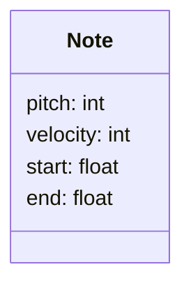

This blog is under construction. Come back later, please. :fire:

<!-- more -->

## Blog writing tips and tricks



Here is a footnote reference,[^1] and another.[^longnote]

A different way to display the image:

Display a Piano Roll and some audio below:

While AI systems, such as machine learning models, can generate content that mimics patterns they've learned from vast amounts of data, **they fundamentally lack** the intrinsic human qualities that drive creativity. True creativity often emerges from a complex interplay of emotions, lived experiences, cultural contexts, and deeply personal insights. It's shaped by our struggles, joys, dreams, and even our subconscious minds. These aspects of the human experience are intricately woven into the tapestry of our creative expressions. In contrast, AI operates devoid of emotion, consciousness, or a sense of self. It lacks intuition and the ability to derive meaning or feel inspiration. An AI can replicate styles, combine patterns, or optimize based on predefined criteria, but it does so without understanding, intent, or genuine innovation. Thus, while AI can produce or assist in artistic endeavors, it will never be _creative_ in the profoundly human sense of the word.





---

Part of the code used to generate this:

```python
from typing import Callable
                           
import numpy as np         
import pandas as pd        


class TimeGrid:                                                      
    def __init__(                                                    
        self,                                                        
        nonlinearity: Callable,                                      
        n_measures: int = 4,                                         
        ticks_per_measure: int = 16,                                 
        measure_duration_s: float = 1,                               
    ):                                                               
        self.n_measures = n_measures                                 
        self.ticks_per_measure = ticks_per_measure                   
                                                                     
        # One measure is a sine period -> 2.pi                       
        stop = n_measures * 2 * np.pi                                
        steps = n_measures * ticks_per_measure                       
        self.linear_grid = np.linspace(                              
            start=0,                                                 
            stop=stop,                                               
            num=steps,                                               
            endpoint=False,                                          
        )                                                            
                                                                     
        # This adjustment could be externalized                      
        nonlinear_adjustment = nonlinearity(self.linear_grid)        
        self.nonlinear_grid = self.linear_grid + nonlinear_adjustment
                                                                     
        # Normalize the nonlinear grid based on the measure duration.
        self.nonlinear_grid /= 2 * np.pi / measure_duration_s        
                                                                     
        self.df = pd.DataFrame({"start": self.nonlinear_grid})       
```


Finally, some GPT created text:[^ref_gpt_a]

While AI systems, such as machine learning models, can generate content that mimics patterns they've learned from vast amounts of data, **they fundamentally lack** the intrinsic human qualities that drive creativity. True creativity often emerges from a complex interplay of emotions, lived experiences, cultural contexts, and deeply personal insights. It's shaped by our struggles, joys, dreams, and even our subconscious minds. These aspects of the human experience are intricately woven into the tapestry of our creative expressions. In contrast, AI operates devoid of emotion, consciousness, or a sense of self. It lacks intuition and the ability to derive meaning or feel inspiration. An AI can replicate styles, combine patterns, or optimize based on predefined criteria, but it does so without understanding, intent, or genuine innovation. Thus, while AI can produce or assist in artistic endeavors, it will never be _creative_ in the profoundly human sense of the word.

## A new header with a nice image


In the maestro datasets we have the information about composer name and the piece title - we should make effort to display it here.

The approach I think should work for this, is to track additional field for every record with a dumped source information:

```py
r = requests.get('https://api.github.com/user', auth=('user', 'pass'))
r.status_code
# 200
```

Does it support mermaid?



Here is an inline note.^[Inlines notes are easier to write, since you don't have to pick an identifier and move down to type the note.]

[^1]: Here is the footnote. Footnotes support emojis :satellite: Don't use `^X` for footnote code. Use named references.

[^longnote]: Here's one with multiple blocks.

    Subsequent paragraphs are indented to show that they
belong to the previous footnote.

[^ref_gpt_a]: Another footnote
