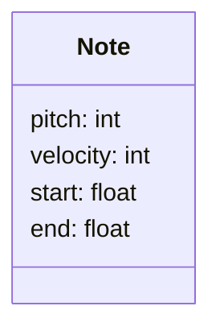

### Introduction



The piano is a versatile and suprisingly complex instrument. It is capable of evoking a vast range of emotions and captivating audiences with its melodies. The pianist, seated before this majestic instrument, becomes a conduit for the composer's intentions, imbuing each note with a depth of feeling that transcends mere sound. The same composition can be played in an infinite number of ways varying form artist to artist, his mood and expression choice. It is in this realm of pianistic artistry that the quest for perfection unfolds - a quest that often centers around the mastery of dynamic expression.

Dynamic expression in piano performance is more than simply playing notes at varying volumes. It encompasses the delicate interplay of timing, touch, and nuance, allowing a performer to breathe life into the music. It allows a pianist to shape the music and add depth to their interpretation by creating tension, release, highlighting important phrases, passing composer's intention and his own artistic interpretation.

Whether it's the gentle caress of a soft passage or the thunderous roar of a climactic crescendo, the ability to model dynamic expression is at the core of what makes a piano performance truly captivating.
Join us on our first step towards understanding this complex algorithm that drives human expression, where we will try and teach an AI not how to compose - but how to play.

*"Talking about music is like dancing about architecture"*, so we invite you to listen to provided samples in order to understand the results and data flow of our project.

### Why is velocity important?

Velocity is a crucial element in music dynamics, determining the force with which a note is played, 
which profoundly influences the emotional quality of music. 

If you were to assign random velocities to a sequence of notes, this is what you would have ended up with:
<div style="-webkit-column-count: 2; -moz-column-count: 2; column-count: 2;">
    
  **Original** 
        
  **Random velocity**

</div>


<div style="-webkit-column-count: 2; -moz-column-count: 2; column-count: 2;">

  
  
        
  
  

</div>


Sounds pretty bad, doesn't it?

Our Transformer-based model aims to decode 
this nuanced aspect of musical expression, unraveling the hidden patterns within piano performance.


### Model Overview
    
*The Transformer model* is ideal for this task because it excels at capturing complex dependencies in sequential data[^Vaswani], making it well-suited for predicting MIDI velocities accurately.

Strong prediction results signify the model's proficiency in extracting vital
features and comprehending intricate relationships. 
Its accurate encoding of quantized MIDI data and precise velocity predictions
mark a significant stride toward the realm of emotionally resonant AI music generation.
### Data Preprocessing
#### MIDI data
MIDI, or Musical Instrument Digital Interface, emerged in the early 1980s as a groundbreaking industry standard aimed at facilitating compatibility and collaboration among diverse electronic musical instruments. This innovation played a pivotal role in catalyzing a rapid expansion of the electronic musical instrument market during that era[^MIDI].

The [file format specifications](https://www.midi.org/specifications-old/category/smf-specifications) for MIDI are complex. Fortunately, there are various software tools for parsing, manipulating, synthesizing, and storing MIDI files. Python package PrettyMidi is able to translate MIDI messages, which can often be obscure and challenging to decipher, into a comprehensible list of note events, making the information more accessible.

To describe piano, we can describe individual notes played by a pianist as a Note object:

Pitch - represented as a number between 0 and 127 (or 21 to 108 for piano keys, reflecting the standard 88-key keyboard).

Start - indicates the moment a key is pressed, measured in seconds.

End - marks the second when the key is released.

Duration - calculated as the time elapsed between the key's press and release.

Velocity - ranging from 0 to 128, indicating the intensity of the key press.

Each musical piece can be described with a dataframe of notes.
```
     duration         end  pitch       start  velocity
0    2.451823    3.449219     69    0.997396        40
1    4.502604    5.505208     64    1.002604        34
2    4.792969    5.828125     58    1.035156        20
3    0.071615    1.753906     76    1.682292        43
4    0.061198    1.809896     78    1.748698        55
..        ...         ...     ..         ...        ..
```

#### Quantization
More suitable approach for quantization was to calculate dstart - distance betweet start time of current note and the next.
```py
notes["next_start"] = notes.start.shift(-1)
notes["dstart"] = notes.next_start - notes.start
```

```
     pitch    dstart  duration  velocity
0       69  0.005208  2.451823        40
1       64  0.032552  4.502604        34
2       58  0.647135  4.792969        20
3       76  0.066406  0.071615        43
4       78  0.074219  0.061198        55
..      ..       ...       ...        ..

```

This way we can achieve a more general data quantization, without having to consider
variations in the song's tempo or using bins that cover the entire duration of 
the sample. This approach ensures consistent quantization regardless of
the length of the composition.

We extracted 128-note samples which we quantized using 3 bins for dstart, 3 for duration and 3 for velocity.
Pitch information remained the same.

Here are **bin edges** we used:
```
dstart:
  - 0.0
  - 0.048177
  - 0.5
duration:
  - 0.0
  - 0.145833
  - 0.450000
velocity:
  - 0.0
  - 57.0
  - 74.0
  - 128.0
```
#### Quantization Samples
<div style="-webkit-column-count: 2; -moz-column-count: 2; column-count: 2;">
    
  **Original** 
        
  **Quantized**

</div>

Franz Schubert / Franz Liszt: *Song Transcriptions: Aufenthalt, Gretchen am Spinnrade, Standchen von Shakespeare, Der Erlkonig*

<div style="-webkit-column-count: 2; -moz-column-count: 2; column-count: 2;">

  
  
        
  
  

</div>


Ludwig van Beethoven:  *Sonata No. 8 in C Minor, Op.13*
<div style="-webkit-column-count: 2; -moz-column-count: 2; column-count: 2;">

  
  
        
  
  

</div>

### Model Architecture

Important hyperparameters:
| hyperparameter | number |
| -------------- | :-----: |
| Number of layers in encoder and decoder | **6** |
| Nuber of heads in attention layers | **8** |
| Dimension of encoder and decoder outputs | **512** |
| Dimension of a hidden layer of position-wise feed-forward network from each layer of encoder and decoder | **2048** |


### Training and Evaluation
#### Data
The vocabulary for our model was generated by considering every combination of quantized information from MIDI notes. The source vocabulary consisted of 2379 unique values, while the target vocabulary included 131 values, accounting for start, end, and padding tokens.

Our training dataset comprised approximately 200 hours of musical data sourced from the 
[The Maestro Dataset](https://magenta.tensorflow.org/datasets/maestro)[^maestro] dataset, which includes 1276 pieces of classical music performed during piano competitions. Each musical piece was segmented into 128-note sequences, with a 64-note overlap between adjacent samples. These sequences were quantized, and each note was mapped to its corresponding index in the source and target vocabularies.

The dataset used for training contained tuples consisting of tokenized MIDI sequences, each with a length of 128, along with their respective velocity values.

#### Hardware and schedule
   Training on (very old) Nvidia GeForce GTX 960M with 4096 MiB of memory for 5 epochs (2723 steps) took only 7,5 hours.
   Each step took ~6 seconds.

#### Results

The model reaches **2.57 loss** and **5.13 average distance** between prediction and real value.
In contrast - untrained model has a **4.9 loss** and **30.7 average distance**
### Demonstration
#### Samples
<div style="-webkit-column-count: 3; -moz-column-count: 3; column-count: 3;">
    
  **Original** 

  **Predicted**

</div>

Johann Sebastian Bach, *Prelude and Fugue in D-sharp Minor*

<div style="-webkit-column-count: 2; -moz-column-count: 2; column-count: 2;">

  
  
        
  
  

</div>

Frédéric Chopin, *Etude Op. 10 No. 12*

<div style="-webkit-column-count: 2; -moz-column-count: 2; column-count: 2;">

  
  
        
  
  

</div>

#### Pieces with predicted velocity
Here are whole pieces from our dataset wirh original and predicted velocities

<div style="-webkit-column-count: 2; -moz-column-count: 2; column-count: 2;">
    
  **Original** 
        

  **Predicted**

</div>

Johann Sebastian Bach, *Prelude and Fugue in A-flat Major, WTC I*

<div style="-webkit-column-count: 2; -moz-column-count: 2; column-count: 2;">

  
  
        
  
  

</div>

Wolfgang Amadeus Mozart, *Sonata in B-flat Major, K*

<div style="-webkit-column-count: 2; -moz-column-count: 2; column-count: 2;">

  
  
        
  
  

</div>

Frédéric Chopin, *Etude Op. 10 No. 12*

<div style="-webkit-column-count: 2; -moz-column-count: 2; column-count: 2;">

  
  
        
  
  

</div>

### Conclusion
As you could see and hear, our model got really good with finding well-sounding velocities for each presented piece.
(Surely far better than random!)
The importance of MIDI velocity in shaping the emotional quality of music cannot be overstated, and our model's ability to accurately predict these velocities has far-reaching implications.

Through meticulous data preprocessing, utilizing quantization techniques, and leveraging the power of the Transformer architecture, our model has demonstrated its proficiency in capturing complex dependencies within music sequences. The training process, conducted on a substantial dataset of classical piano music, yielded impressive results with a minimal average distance between predictions and real values.

What is perhabs the most impressive outcome of this experiment, is that a transformer was able to learn underlying schemas behind human performances. This could indicate that there really is a very complex and possibly untranslatable algorithm behind our perception of emotion in music.


### Contact and Feedback
As we continue to refine and expand the capabilities of our model, we invite further exploration, collaboration, and feedback from the musical community and AI enthusiasts. Together, we can push the boundaries of what AI can achieve in the art of music, unlocking new creative possibilities and enriching the musical landscape.

author: wmatejuk14@gmail.com

[^Vaswani]: [Vaswani, Ashish & Shazeer, Noam & Parmar, Niki & Uszkoreit, Jakob & Jones, Llion & Gomez, Aidan & Kaiser, Lukasz & Polosukhin, Illia. (2017). Attention Is All You Need.](https://arxiv.org/abs/1706.03762)
[^MIDI]: [ Frank Zalkow and Meinard Müller. Symbolic Format: MIDI - Fundamentals of music processing](https://www.audiolabs-erlangen.de/resources/MIR/FMP/C1/C1S2_MIDI.html)
[^maestro]: [The Maestro dataset](https://magenta.tensorflow.org/datasets/maestro)
