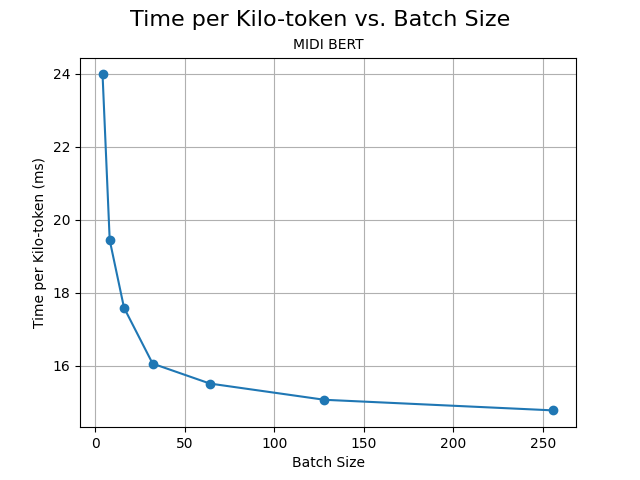

## Comparison
We'll be comparing the following datasets:
A. **MyMaskedMidiDataset** from [midi-bert](https://github.com/Nospoko/midi-bert/blob/abc596e633128ca53ee0a1efaf53daa6e200a2ee/data/dataset.py#L83)
B. **MidiDataset** from [masked-midi-modeling](https://github.com/Nospoko/masked-midi-modeling/blob/7c22e7dd681822f8b7a0b5b7276b11b262bff6b8/data/dataset.py#L78)
both dataset need data in different format, here's an overview of how to create them

## The Data
To maintain consistency, our comparison will be based on the [maestro-v1-sustain](https://huggingface.co/datasets/roszcz/maestro-v1-sustain) dataset. Both datasets require data to be pre-processed in different formats..

#### Preparation time
**MyMaskedMidiDataset**:
Preparation took an average of `3min 39s` per loop, with the loop running 5 times.

**MidiDataset**:
In contrast, this dataset was speedier, clocking in at `18.9 s` per loop over 10 iterations.

The pre-processing times mentioned above were calculated on a test set, with the records having these metrics:
`Mean: 4188.757062146893, std: 3130.797449499849, max: 16966, min: 366, median: 3264.0`

## Benchmarking Dataset Performance
To understand the datasets' real-time performance, we used the following benchmarking code:
```python
for batch_size in tqdm(BATCH_SIZES):
    loader = DataLoader(test_set, batch_size=batch_size, shuffle=True)
    
    # Warm-up phase: loop a few times but don't measure the time
    # This is to avoid including cache time in the measurement
    for _ in range(3):
        for _ in loader:
            pass

    # Actual measurement
    start_time = time.time()

    total_tokens = 0
    while total_tokens < 1_000_000:
        batch = next(iter(loader))
        total_tokens += batch["input_ids"].nelement()

    end_time = time.time()
    total_time = end_time - start_time

    time_per_kilotoken = total_time * 1_000 / (total_tokens / 1000)  # Convert to miliseconds for kilotoken
    results.append((batch_size, time_per_kilotoken))
```
lines 6-8 are used to warm-up the cache, without it the first batch is always slower than the rest.
Additionally, each loader is shuffled to avoid any bias.
#### Performance insights
- **MyMaskedMidiDataset** performance:

<!--  -->
- **MidiDataset** performance:

<!--  -->
As we can see, the trend suggests that with larger batch sizes, the performance of both datasets improves. However, the **MidiDataset** is consistently faster than **MyMaskedMidiDataset** by a factor of 4-5 times.


## TODO: tips?